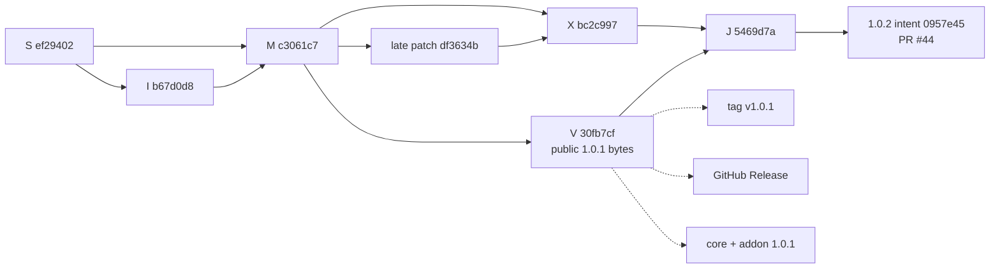

# Issue #19 public release evidence

**Status: completed live proof on 2026-07-16.**

This document records the bounded `fablebookjs/lab-01` public patch release.
It is evidence for [`fablebookjs/infra#19`](https://github.com/fablebookjs/infra/issues/19),
not a production support policy or a Storybook migration claim.

## Exact Git identities

| Role | SHA | Contract |
| --- | --- | --- |
| Release source `S` | `ef29402dc87d08e17e0988b7ee22fdf93f7c4b7f` | Exact source sealed by the ready proposal |
| Staged intent `I` | `b67d0d8891c2583b63eb8936efc22b6313160a0f` | One-parent empty `1.0.1` intent over `S` |
| Release merge `M` | `c3061c74b52aea7b9ee47b99950f4fee13bce911` | Ordered parents `[S,I]` |
| Version snapshot `V` | `30fb7cf66944462d56edf9d64198377a4b0d2f4c` | One parent `M`; tree `f1a1bcbe9df4d499d761356c2f139d0a70d98a37` |
| Late patch `P` | `df3634b8593e76e730d191f57ba1a7a1b2456a0b` | One parent `M` |
| Ordinary late merge `X` | `bc2c99750191ccdb14662c139ba9ea725d3a8a12` | Ordered parents `[M,P]`, same tree as `P` |
| Reconciliation `J` | `5469d7a4d12abde629ba5384aaac2f0f19fb5b96` | Ordered parents `[X,V]`; clean tree `c553d078baa3c2b242b864a430c9b4eaccf26038` |
| Next intent | `0957e45dacfa3e4f6efedfeed6c338866553833d` | One-parent empty `1.0.2` intent over `J` |

The lightweight tag `v1.0.1` resolves exactly to `V`, not `J`. Git ancestry
read-back returns false for `X -> V` and true for `X -> J`. Therefore the late
fix is absent from the published `1.0.1` snapshot and retained in the release
line and [draft `1.0.2` PR #44](https://github.com/fablebookjs/lab-01/pull/44).
PR #44 has one empty intent commit and zero changed files.

## Final retained refs

| Ref or object | Final read-back |
| --- | --- |
| `refs/heads/releases/v1.0` | `J` = `5469d7a4d12abde629ba5384aaac2f0f19fb5b96` |
| `refs/heads/staged/v1.0` | next intent = `0957e45dacfa3e4f6efedfeed6c338866553833d` |
| `refs/heads/release-snapshots/v1.0.1` | `V` = `30fb7cf66944462d56edf9d64198377a4b0d2f4c` |
| `refs/tags/v1.0.1` | lightweight tag at exact `V` |
| `refs/heads/finalizer-attempts/v1.0.1/github-release` | spent at exact `V` |
| `refs/heads/finalizer-attempts/v1.0.2/next-proposal` | spent at exact next intent |
| `refs/heads/recovery/v1.0/1.0.1` | absent; the live line reconciled cleanly |

## Public `1.0.0` baseline

The one-time interactive bootstrap published bytes from immutable tag
`v1.0.0`, commit `b59edf1d4c0fff51295327e8ce9e72678c336156`, tree
`c17e4b63e8fd8b0bff28e1b9e24caa203d29d80e`. The exact read-back recorded in
the [issue #19 baseline checkpoint](https://github.com/fablebookjs/infra/issues/19#issuecomment-4990036278) was:

| Package | SHA-512 integrity | SHA-1 shasum |
| --- | --- | --- |
| `@fablebook/lab-01-core@1.0.0` | `sha512-D2/F0PkQoENQagqntg1tUB0zn8lOen0jnqvyw0sbRLN3fkMJ4OR60geERuANxq0Ihx0RlCoYoP1lQhzb2KQZ+g==` | `8ff5241867ebd1c2747c23ea016342c7cd101f6d` |
| `@fablebook/lab-01-addon@1.0.0` | `sha512-DssrVgnRMbPG5qVqt0yr43ImplnR2YJZyCZkr0Yvp5h+wJHo5x9qL2Svpo3GyruuMZm1zdIhKJPAYYmZe7m78g==` | `5ccab401d844a0254bd1914b5b96d798462a5017` |

## Public package identities

| Package | SHA-512 integrity | SHA-1 shasum | Provenance workflow run / trusted `main` |
| --- | --- | --- | --- |
| [`@fablebook/lab-01-core@1.0.1`](https://www.npmjs.com/package/@fablebook/lab-01-core/v/1.0.1) | `sha512-oVlZGsOXOEm+CSRQUq+zt+1ODXD8WmJCV2vuhQobwvszLpm1BdQuBDSrvS9GgTK4gKE+PcUUWb0matCMsBFXvg==` | `207948a32b5861be7fa228487f980a012d503752` | [`publish-npm.yml` run 29487214563](https://github.com/fablebookjs/lab-01/actions/runs/29487214563) / `692585e199dc9e76285539b9f7bbbb0423e2fb0f` |
| [`@fablebook/lab-01-addon@1.0.1`](https://www.npmjs.com/package/@fablebook/lab-01-addon/v/1.0.1) | `sha512-AKDdvZR9qpCE29BAkMnq4Ojvdo8DXvFI2CgKUm2aj82gAx/n2OUSVmHIKlIGldR1qhc7rkS6a7qM0v0J+3o0iQ==` | `657e6939b6cf52b6a34ca107caf49d4e2dba824e` | [`publish-npm.yml` run 29488397580](https://github.com/fablebookjs/lab-01/actions/runs/29488397580) / `0849eca26621f7f184479e500764862653923b2b` |

Both registry entries match the tarballs independently packed from `V`, carry
the exact monorepo repository identity, and expose SLSA provenance
attestations. The add-on depends only on exact core `1.0.1`. A clean external
consumer installed and imported both packages with exports `core=["add"]` and
`addon=["total"]`. A fresh read-only verification on 2026-07-16 ran
`npm audit signatures --json` against the exact install and returned
`{"invalid":[],"missing":[]}`: no invalid and no missing signatures. These are post-release registry verifications,
not claims about the publisher artifacts' `consumer` field.

The partial-publication boundary is retained in
[core run 29487214563](https://github.com/fablebookjs/lab-01/actions/runs/29487214563):
core was exact and public while add-on was absent. The continuation
[add-on run 29488397580](https://github.com/fablebookjs/lab-01/actions/runs/29488397580)
reverified core, published only add-on, and recorded both packages as matching.
The OIDC jobs contained no traditional npm token and executed no candidate code.

## Workflow and GitHub evidence

| Boundary | Retained evidence |
| --- | --- |
| Current exact Ready QA | [run 29487012788](https://github.com/fablebookjs/lab-01/actions/runs/29487012788) |
| Deterministic `V` creation | [run 29487113659](https://github.com/fablebookjs/lab-01/actions/runs/29487113659) |
| Core-only public state | [run 29487214563](https://github.com/fablebookjs/lab-01/actions/runs/29487214563) |
| Add-on continuation | [run 29488397580](https://github.com/fablebookjs/lab-01/actions/runs/29488397580) |
| Clean `J=[X,V]` reconciliation | [run 29489041168](https://github.com/fablebookjs/lab-01/actions/runs/29489041168) |
| Maintainer yields to `J` | [run 29489635435](https://github.com/fablebookjs/lab-01/actions/runs/29489635435) |
| Lightweight tag creation | [run 29489692288](https://github.com/fablebookjs/lab-01/actions/runs/29489692288) |
| Release-attempt authorization | [run 29489828068](https://github.com/fablebookjs/lab-01/actions/runs/29489828068) |
| Intentional post-Release failure | [run 29489970777](https://github.com/fablebookjs/lab-01/actions/runs/29489970777) |
| Lost-success recovery and `1.0.2` intent | [run 29490136244](https://github.com/fablebookjs/lab-01/actions/runs/29490136244) |
| Next-proposal authorization | [run 29490276054](https://github.com/fablebookjs/lab-01/actions/runs/29490276054) |
| Exact draft PR creation | [run 29490413923](https://github.com/fablebookjs/lab-01/actions/runs/29490413923) |
| Duplicate finalizer convergence | [run 29490566032](https://github.com/fablebookjs/lab-01/actions/runs/29490566032) |
| Maintainer yields to PR #44 | [run 29490710157](https://github.com/fablebookjs/lab-01/actions/runs/29490710157) |

The exact non-draft, non-prerelease [GitHub Release
`v1.0.1`](https://github.com/fablebookjs/lab-01/releases/tag/v1.0.1) has ID
`355007030` and target `V`. Run `29489970777` deliberately failed after the
Release POST and exact hydration. Its retry issued no second Release POST and
continued from the one durable object. The finalizer convergence run made zero
mutations and reused PR #44.

The authority chain began with [release PR #12](https://github.com/fablebookjs/lab-01/pull/12):
exact staged intent `I`, source `S`, and current [Ready-QA run
29487012788](https://github.com/fablebookjs/lab-01/actions/runs/29487012788)
were sealed by ordered merge `M=[S,I]`. Snapshot run `29487113659` then
reconstructed the allowlisted four-file transform from `M`, bound the package
hashes, and created exact `V`.

## Scope and retained calibration

The live line followed the normal clean path. The destructive conflict path was
not repeated on the real release line; issue #19 reuses these retained G1
proofs, whose refs and PRs remained untouched:

- current-head required-check binding: [PR #23](https://github.com/fablebookjs/lab-01/pull/23),
  [A run 29449854427](https://github.com/fablebookjs/lab-01/actions/runs/29449854427),
  [advance run 29449898852](https://github.com/fablebookjs/lab-01/actions/runs/29449898852),
  and [B run 29449963241](https://github.com/fablebookjs/lab-01/actions/runs/29449963241);
- lifecycle refresh and close/regenerate: [runs 29414022821](https://github.com/fablebookjs/lab-01/actions/runs/29414022821),
  [29414043206](https://github.com/fablebookjs/lab-01/actions/runs/29414043206),
  and [29414470336](https://github.com/fablebookjs/lab-01/actions/runs/29414470336);
- conflict backup/force/resume and exactly one recovery PR:
  [PR #16](https://github.com/fablebookjs/lab-01/pull/16) and
  [runs 29429579354](https://github.com/fablebookjs/lab-01/actions/runs/29429579354),
  [29429674616](https://github.com/fablebookjs/lab-01/actions/runs/29429674616),
  and [29429754785](https://github.com/fablebookjs/lab-01/actions/runs/29429754785);
- recovery-open suppression and exactly-one next proposal:
  [PR #26](https://github.com/fablebookjs/lab-01/pull/26),
  [PR #27](https://github.com/fablebookjs/lab-01/pull/27), and
  [runs 29454762852](https://github.com/fablebookjs/lab-01/actions/runs/29454762852),
  [29454800587](https://github.com/fablebookjs/lab-01/actions/runs/29454800587),
  [29454848877](https://github.com/fablebookjs/lab-01/actions/runs/29454848877),
  and [29454904814](https://github.com/fablebookjs/lab-01/actions/runs/29454904814).

The complete prior authority record is retained in
[`fablebookjs/infra#15`](https://github.com/fablebookjs/infra/issues/15).

No controller in this proof has a Storybook repository, package, credential, or
API target. The evidence establishes process-local non-mutation for the exact
lab Git/GitHub/npm adapters; it does not claim omniscient observation of every
external Storybook resource.
